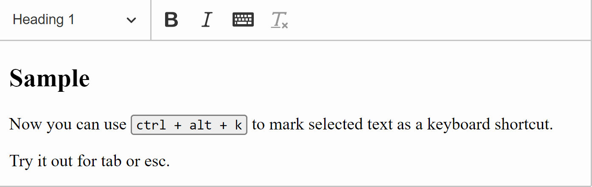

[](https://www.npmjs.org/package/@mlewand/ckeditor5-keyboard-marker)

# CKEditor 5 keyboard marker

This plugin adds support for the keyboard input element (`<kbd>`) to CKEditor 5.



## Installation

* Follow the [Creating custom builds](https://ckeditor.com/docs/ckeditor5/latest/builds/guides/development/custom-builds.html) guide.
* Execute `npm i @mlewand/ckeditor5-keyboard-marker --save` (or `yarn add @mlewand/ckeditor5-keyboard-marker`)
* Include the `Kbd` plugin and add `kbd` button to the toolbar (if desired).

An example configuration:

```js
'use strict';

// The editor creator to use.
import ClassicEditorBase from '@ckeditor/ckeditor5-editor-classic/src/classiceditor';

import EssentialsPlugin from '@ckeditor/ckeditor5-essentials/src/essentials';
import AutoformatPlugin from '@ckeditor/ckeditor5-autoformat/src/autoformat';
import BoldPlugin from '@ckeditor/ckeditor5-basic-styles/src/bold';
import ItalicPlugin from '@ckeditor/ckeditor5-basic-styles/src/italic';
import HeadingPlugin from '@ckeditor/ckeditor5-heading/src/heading';
import LinkPlugin from '@ckeditor/ckeditor5-link/src/link';
import ListPlugin from '@ckeditor/ckeditor5-list/src/list';
import ParagraphPlugin from '@ckeditor/ckeditor5-paragraph/src/paragraph';
import RemoveFormat from '@ckeditor/ckeditor5-remove-format/src/removeformat';

import Kbd from '@mlewand/ckeditor5-keyboard-marker/src/Kbd';

export default class ClassicEditor extends ClassicEditorBase {}

// Plugins to include in the build.
ClassicEditor.builtinPlugins = [
	EssentialsPlugin,
	AutoformatPlugin,
	BoldPlugin,
	ItalicPlugin,
	HeadingPlugin,
	LinkPlugin,
	ListPlugin,
	ParagraphPlugin,
	RemoveFormat,

	Kbd
];

ClassicEditor.defaultConfig = {
	toolbar: [ 'heading', '|', 'bold', 'italic', 'kbd', 'removeFormat' ],

	// This value must be kept in sync with the language defined in webpack.config.js.
	language: 'en'
};
```
